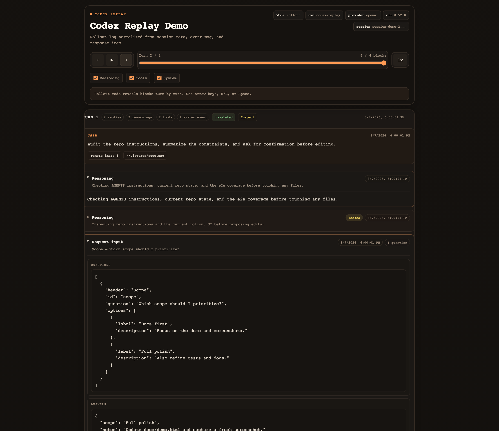

# codex-replay

Turn Codex JSONL sessions into self-contained HTML replays.

It is based on [`claude-replay`](https://github.com/es617/claude-replay), adapted for Codex JSONL logs and Codex-specific replay UX.

It supports two Codex-native inputs:

- rollout logs from `~/.codex/sessions/**/rollout-*.jsonl`
- persistent prompt history from `~/.codex/history.jsonl`

Rollout files render as an interactive turn-by-turn player with reasoning, tool, and system filters. History files render as a grouped session timeline.



Generated demo replay screenshot. Regenerate it with `npm run docs:demo`.

## Install

Install with npm:

```bash
npm install -g codex-replay
```

Then run it from your terminal:

```bash
codex-replay
```

Or run it once without installing:

```bash
npx codex-replay ~/.codex/sessions/2026/03/07/rollout-*.jsonl -o replay.html
```

If you run `codex-replay` in a TTY without an input path, it opens an interactive session picker that scans your local Codex JSONL files, merges history plus rollout trees by `session_id`, and shows one row per session.

## Usage

```bash
codex-replay [input.jsonl] [options]
```

Quick start:

```bash
# Open the interactive picker from ~/.codex
codex-replay

# Render a single rollout log to HTML
codex-replay ~/.codex/sessions/2026/03/07/rollout-abc.jsonl -o replay.html
```

Examples:

```bash
# TTY picker from ~/.codex
codex-replay

# Force the picker and scan a custom Codex home
codex-replay --pick --codex-home ~/tmp/demo-codex

# Rollout replay
codex-replay ~/.codex/sessions/2026/03/07/rollout-abc.jsonl -o replay.html

# History timeline
codex-replay ~/.codex/history.jsonl --format history -o history.html

# Filter by time and hide reasoning by default
codex-replay rollout.jsonl --from "2026-03-07T01:00:00Z" --to "2026-03-07T02:00:00Z" --no-reasoning -o replay.html

# Use a built-in theme and add bookmarks
codex-replay rollout.jsonl --theme oxide-blue --mark "1:Kickoff" --mark "2:Fix" -o replay.html
```

## Options

| Option | Description |
| --- | --- |
| `-o, --output FILE` | Write HTML to a file instead of stdout |
| `--pick` | Open the interactive Codex session picker |
| `--codex-home DIR` | Scan a custom Codex home instead of `~/.codex` |
| `--limit N` | Limit only the non-TTY fallback picker rows before requiring filter narrowing |
| `--format auto|rollout|history` | Force input detection |
| `--from TIMESTAMP` | Keep turns at or after this ISO timestamp |
| `--to TIMESTAMP` | Keep turns at or before this ISO timestamp |
| `--speed N` | Initial playback speed |
| `--no-reasoning` | Hide reasoning blocks by default |
| `--no-tools` | Hide tool blocks by default |
| `--no-system` | Hide system notice blocks by default |
| `--theme NAME` | Built-in theme name |
| `--theme-file FILE` | Load a custom theme JSON file |
| `--mark "N:Label"` | Add a bookmark to turn `N` |
| `--bookmarks FILE` | Read bookmarks from JSON |
| `--no-redact` | Disable secret redaction |
| `--no-minify` | Use `template/player.html` instead of the minified build |
| `--no-compress` | Embed raw JSON instead of deflated Base64 |
| `--list-themes` | Print built-in themes |
| `--no-thinking` | Deprecated alias for `--no-reasoning` |
| `--no-tool-calls` | Deprecated alias for `--no-tools` |

## Picker

The picker scans:

- `~/.codex/history.jsonl`
- `~/.codex/sessions/**/rollout-*.jsonl`

In a TTY it renders one row per session:

- `linked`: a history session merged with its rollout tree
- `history-only`: a session only present in `history.jsonl`
- `rollout-only`: a rollout tree with no matching history session

Each row shows the latest activity time, project/cwd when available, session kind, turn count or grouped rollout count, and a preview of the first user prompt.

TTY picker keys:

- `Up` / `Down`: move selection
- `PageUp` / `PageDown`: jump by viewport
- type text: filter by prompt preview, session id, project name, agent nickname, file path, or kind
- `Enter`: render and open the selected replay immediately
- `S`: save the selected replay to a file
- `Esc`: clear the filter, or quit if the filter is already empty
- `Q`: quit

When stdin/stdout are not TTYs, the picker falls back to a numbered prompt. That fallback is the only mode affected by `--limit`.

## Themes

Built-in themes:

- `cinder-amber`
- `oxide-blue`
- `paper-stack`
- `terminal-moss`

You can also supply a JSON theme file. Missing keys fall back to `cinder-amber`.

```json
{
  "bg": "#101820",
  "accent": "#ff7a59",
  "extraCss": ".page-title { letter-spacing: -0.03em; }"
}
```

## Rendering model

Rollout mode normalizes these record types:

- `session_meta`
- `event_msg`
- `response_item`
- `turn_context`

Supported replay blocks:

- assistant messages with phase badges
- reasoning blocks, including encrypted placeholders
- tool calls and paired outputs
- `request_user_input` question/answer cards
- custom tool calls
- web search notices
- plan/system notices

History mode groups entries by `session_id` and sorts them by timestamp inside each session.

## Redaction

Secret redaction is enabled by default before data is embedded into HTML. Common API key, bearer token, JWT, connection string, and private key patterns are replaced with `[REDACTED]`.

Use `--no-redact` only when you explicitly want the raw transcript embedded.

## Development

```bash
npm install
npm run build
npm run docs:demo
npm test
npm run test:e2e
```

`npm run build` regenerates `template/player.min.html` from `template/player.html`.
`npm run docs:demo` regenerates [`docs/demo.html`](./docs/demo.html) and captures a fresh headless screenshot at [`docs/screenshot-demo.png`](./docs/screenshot-demo.png).

## License

MIT
